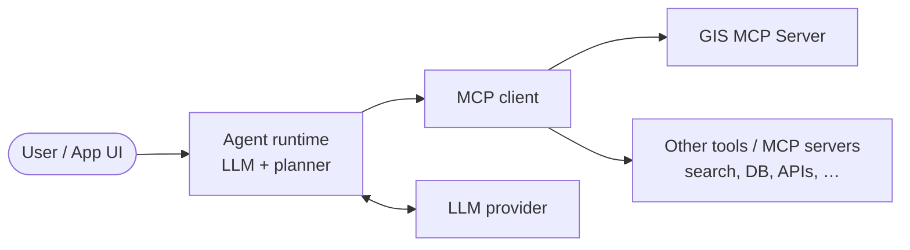
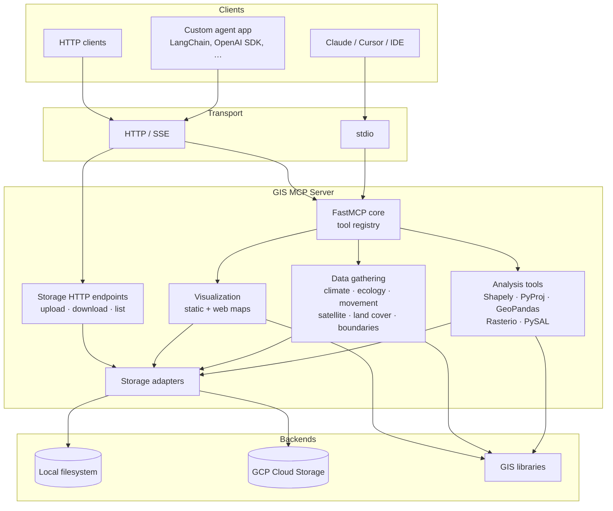
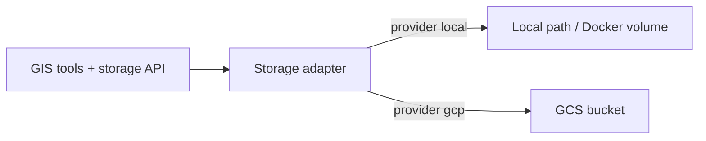

## Architecture

This page explains **where GIS MCP Server sits in agentic AI apps** and **how the server is structured inside**. Diagrams live here (not in the GitHub README) so the docs stay the place for conceptual overview.

---

## Role in agentic AI applications

An agentic app usually combines:

- An **LLM** that reasons and plans
- An **agent runtime / framework** (LangChain, OpenAI Agents SDK, Claude Desktop, Cursor, custom apps)
- **Tools and MCP servers** that perform real actions (search, databases, APIs, GIS, …)

**GIS MCP Server** is the geospatial tool layer. The LLM does not invent GIS math from scratch; it calls GIS MCP tools for buffers, projections, raster ops, spatial stats, data downloads, and related work. Other MCP servers or tools can sit beside it (web search, calendars, code runners, etc.).

**What GIS MCP contributes**

| Concern | Who handles it |
| -------- | -------------- |
| Natural language, planning, tool choice | LLM + agent runtime |
| Buffers, CRS, rasters, GeoPandas, PySAL, maps | **GIS MCP Server** |
| Files / layers persistence | GIS MCP **storage** (local or GCS) |
| Non-GIS actions | Other tools / MCP servers |

Typical flow: the user asks a spatial question → the agent selects GIS tools → GIS MCP runs library code → results (numbers, GeoJSON, files, maps) return to the agent → the LLM explains or continues the workflow.

---

## Server architecture and components

At a high level the process is: **transport → MCP server → tools → GIS libraries**, with a shared **storage** backend for inputs/outputs.

### Component summary

| Component | Role |
| --------- | ---- |
| **Transports** | `stdio` for desktop MCP clients; `HTTP` / `SSE` for remote agents and REST-style storage access |
| **FastMCP core** | Registers tools and handles MCP protocol messages |
| **Analysis tools** | Geometry, CRS, vector/raster processing, spatial statistics |
| **Data gathering** | Download / fetch workflows (climate, ecology, OSM networks, imagery, boundaries, …) |
| **Visualization** | Static maps and interactive web maps |
| **Storage adapters** | Local disk (default) or GCS bucket when you configure GCP |
| **Storage HTTP API** | `/storage/upload`, `/storage/download`, `/storage/list` (HTTP/SSE mode) |

### Storage in the architecture

Configure storage as described in [Storage Configuration](storage-configuration.md).

---

## Where to go next

- [Getting Started](getting-started.md) — install and run the server
- [Agent Tutorials](gis-ai-agent/README.md) — overview, framework choice, and tutorials
- [GIS MCP agent architecture](gis-ai-agent/architecture.md) — user → agent → GIS MCP → tools → data
- [Best practices for GIS agents](gis-ai-agent/best-practices.md) — tools, CRS, planning, multi-agent habits
- [HTTP Transport](http-transport.md) — remote agent connectivity
- [Server Endpoints](endpoints.md) — MCP and storage HTTP routes
