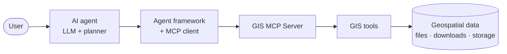

# Agent Tutorials

Build AI agents that perform real geospatial work by connecting an agent framework to **GIS MCP Server**.

This section is the documentation home for GIS-enabled agents: concepts, architecture, framework choice, best practices, and framework-specific tutorials.

## What is a GIS-enabled AI agent?

A GIS-enabled AI agent is an application where:

1. A user asks a geospatial question in natural language (or triggers a workflow).
2. An **agent framework** and **LLM** decide which tools to call and in what order.
3. Those tools run against **real GIS libraries** through GIS MCP Server—not invented coordinates or made-up spatial math.

The agent handles language, planning, and tool selection. GIS MCP Server handles buffers, CRS transforms, vector/raster analysis, spatial statistics, optional data downloads, and optional map outputs.

## Role of GIS MCP Server

**GIS MCP Server** is a [Model Context Protocol (MCP)](https://modelcontextprotocol.io/) server. It exposes geospatial operations as MCP tools that any compatible MCP client can discover and invoke.

In an agent stack, GIS MCP is the **geospatial tool layer**:

| Layer | Responsibility |
| ----- | -------------- |
| User / app UI | Questions, goals, review of results |
| LLM + agent framework | Reasoning, planning, memory, tool choice |
| MCP client (in the agent app) | Connects to GIS MCP over stdio, HTTP, or SSE |
| **GIS MCP Server** | Runs registered GIS tools and returns results |
| GIS libraries + storage | Shapely, PyProj, GeoPandas, Rasterio, PySAL, optional extras; local or GCS storage |

GIS MCP does **not** replace the agent framework. It does not provide its own multi-agent orchestrator, long-term memory store, or LLM. Those belong in the agent runtime you choose.

## How GIS MCP fits between an agent and GIS operations

Typical path:

1. The user asks something spatial (“buffer these parks 100 m and intersect with buildings”).
2. The agent framework selects MCP tools (for example GeoPandas/Shapely operations).
3. GIS MCP executes those tools against libraries and configured storage.
4. Results (numbers, geometries, file paths, maps when the visualize extra is installed) return to the agent.
5. The LLM explains, continues the workflow, or stops.

For server internals (transports, tool categories, storage adapters), see [GIS MCP agent architecture](architecture.md) and the project [Architecture](../architecture.md) page.

## Available tutorials

| Framework | Status | Entry point |
| --------- | ------ | ----------- |
| [LangChain (Python)](langchain/README.md) | Available | [Park buffer proximity agent](langchain/basic-geospatial-agent.md) |
| [OpenAI Agents SDK (Node.js)](openai-nodejs/README.md) | Available | [Basic geospatial agent](openai-nodejs/basic-geospatial-agent.md) |

Runnable sample projects also live in the repository under [`agents/`](https://github.com/mahdin75/gis-mcp/tree/main/agents).

## Planned tutorials

These frameworks were prioritized for documentation after an architecture and adoption audit. Pages below are **stubs** until tutorials ship—do not expect runnable guides yet.

| Framework | Planned focus | Entry point |
| --------- | ------------- | ----------- |
| [LangGraph](langgraph/README.md) | Stateful multi-step GIS pipelines | [Stateful agent](langgraph/stateful-geospatial-agent.md), [Multi-agent workflow](langgraph/multi-agent-geospatial-workflow.md) |
| [CrewAI](crewai/README.md) | Role-based multi-agent GIS crews | [Multi-agent crew](crewai/multi-agent-geospatial-crew.md) |
| [LlamaIndex](llamaindex/README.md) | Retrieval + GIS MCP tools | [RAG + GIS MCP](llamaindex/rag-geospatial-agent.md) |
| [Google ADK](google-adk/README.md) | GCP-oriented agent apps (evaluate on demand) | [ADK + GIS MCP](google-adk/adk-geospatial-agent.md) |

Frameworks such as AutoGen / classic Semantic Kernel, AutoGPT, BabyAGI, MetaGPT, and SuperAGI are **not** prioritized for first-wave tutorials. See [Choosing an agent framework](choosing-framework.md).

## How to choose a framework

Short version:

- **Start here (Python):** [LangChain](langchain/README.md) — existing end-to-end tutorial.
- **JavaScript / TypeScript:** [OpenAI Agents SDK](openai-nodejs/README.md).
- **Stateful / branching workflows:** wait for or contribute [LangGraph](langgraph/README.md).
- **Role-based multi-agent teams:** wait for or contribute [CrewAI](crewai/README.md).
- **Document/RAG-heavy GIS apps:** wait for or contribute [LlamaIndex](llamaindex/README.md).

Full comparison criteria: [Choosing an agent framework](choosing-framework.md).

## Foundation guides

| Guide | Contents |
| ----- | -------- |
| [GIS MCP agent architecture](architecture.md) | User → agent → framework → GIS MCP → tools → data |
| [Choosing an agent framework](choosing-framework.md) | Fit, MCP transport, maturity, maintenance |
| [Best practices for GIS agents](best-practices.md) | Tools, CRS, validation, planning, multi-agent habits |

## Prerequisites shared by agent tutorials

Most custom agent samples in this project expect:

1. **GIS MCP Server installed** — see [pip](../install/pip.md) or [Docker](../install/docker.md).
2. **HTTP transport** for remote/custom agents — see [HTTP Transport](../http-transport.md). Existing LangChain and OpenAI samples use `http://localhost:9010/mcp`.
3. An **LLM API key** for the framework you use (for example OpenRouter or OpenAI), configured in the agent app—not inside GIS MCP.
4. Optional extras (`[visualize]`, `[climate]`, data-gathering packages, and so on) only if your workflow needs those tools — see [Getting Started](../getting-started.md).

Desktop MCP clients (Claude Desktop, Cursor) typically use **stdio** instead of HTTP; that path is covered in the install docs and does not require the agent tutorial stack.

## Related documentation

- [Architecture](../architecture.md) — server components and transports
- [Workflow examples](../examples/README.md) — Claude-oriented geospatial workflows you can reuse as agent test prompts
- [Vibe coding](../vibe-coding.md) — `llms.txt` / `llms-full.txt` for AI coding assistants
- [API reference](../data-gathering/README.md) — tools by category

## Need help?

- [GitHub repository](https://github.com/mahdin75/gis-mcp)
- [Discord](https://discord.gg/dzkXZsZK)
- [GitHub Issues](https://github.com/mahdin75/gis-mcp/issues)
