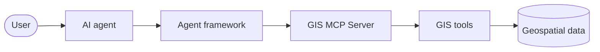
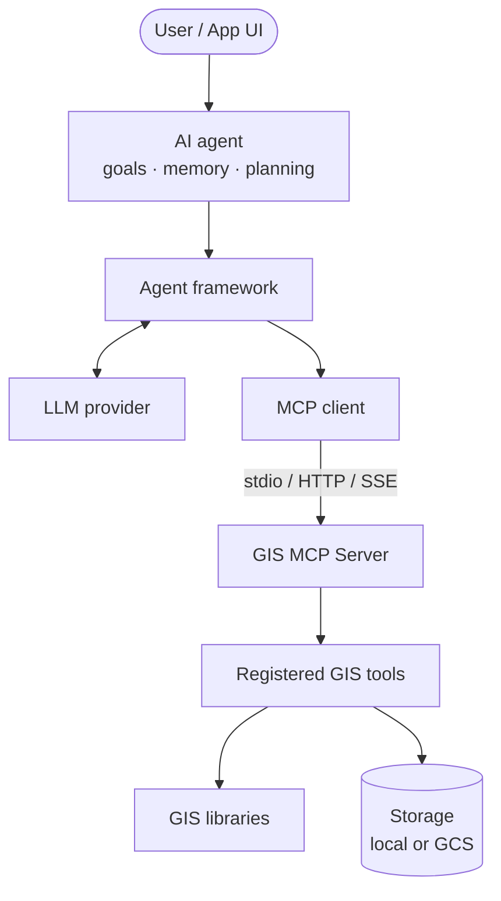
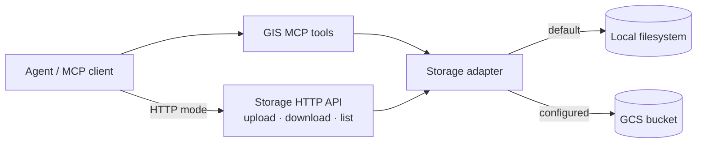

# GIS MCP agent architecture

This page describes how **GIS-enabled agents** use GIS MCP Server. For the server’s internal components (tool modules, storage adapters, transports), also see the project [Architecture](../architecture.md) page.

## End-to-end flow

GIS MCP sits between the agent runtime and geospatial libraries. The agent never talks to Shapely or Rasterio directly; it calls MCP tools that GIS MCP executes.



Expanded view with the MCP client and LLM:



### Step by step

1. **User** — Asks a spatial question or starts a workflow.
2. **AI agent** — Holds the goal, conversation context, and (if the framework supports it) memory or checkpoints.
3. **Agent framework** — Implements the agent loop, tool binding, and orchestration (single agent, graph, or multi-agent).
4. **MCP client** — Part of the agent app; connects to GIS MCP and loads tool schemas.
5. **GIS MCP Server** — FastMCP-based process that registers and runs geospatial tools.
6. **GIS tools** — Operations exposed via MCP (analysis, optional data gathering, optional visualization, save helpers).
7. **Geospatial data** — Files on disk or in configured storage, plus datasets fetched by optional data-gathering tools.

## What each layer owns

| Layer | Owns | Does not own |
| ----- | ---- | ------------ |
| User / app | Intent, review, domain decisions | Spatial algorithm correctness |
| LLM + agent framework | Language, planning, tool selection, retries, multi-agent roles | Authoritative GIS computation |
| MCP client | Transport connection, tool discovery/invocation | GIS library behavior |
| **GIS MCP Server** | MCP tool surface, execution against libraries, storage access | Choosing which business goal to pursue |
| GIS libraries | Geometry, CRS, raster, spatial stats, etc. | Natural-language understanding |

## How agents connect

GIS MCP supports multiple transports. Agent tutorials in this repo primarily use **HTTP** so the server and agent can run in separate processes.

| Transport | Typical client | Notes |
| --------- | -------------- | ----- |
| **stdio** | Claude Desktop, Cursor, Smithery | Default for local desktop MCP configs |
| **HTTP** | Custom agents (LangChain, OpenAI Agents SDK, …) | MCP endpoint at `/mcp`; storage HTTP API available |
| **SSE** | Streaming MCP clients | SSE endpoint at `/sse` when enabled |

Configure transport with environment variables such as `GIS_MCP_TRANSPORT`, `GIS_MCP_HOST`, and `GIS_MCP_PORT`. Details: [HTTP Transport](../http-transport.md), [Server Endpoints](../endpoints.md).

Existing sample agents connect to:

```text
http://localhost:9010/mcp
```

That URL assumes HTTP mode with host/port set accordingly (common in Docker and the published LangChain / OpenAI samples).

## Tool surface available to agents

When an MCP client calls tool discovery, it receives whatever tools were registered in the running server process.

**Always available** (core install): analysis-oriented tools backed by Shapely, PyProj, GeoPandas, Rasterio, and PySAL, plus result-saving helpers.

**Optional** (install extras / optional dependencies):

- Data gathering (administrative boundaries, climate, ecology, movement, satellite imagery, land cover)
- Visualization (`create_map`, `create_web_map`)
- GCP storage backend

If an extra is not installed, those tools are not registered. Agents cannot call tools that are not present on the server.

Catalogs and per-tool docs live under [Data Gathering](../data-gathering/README.md) and the Analysis / Visualization API sections in the docs nav.

## Data and storage path



- Tools read and write through the configured storage adapter (local path by default, or GCS when configured).
- In HTTP mode, clients may also use `/storage/upload`, `/storage/download`, and `/storage/list`.
- Configuration: [Storage Configuration](../storage-configuration.md).

## Single-agent vs multi-agent

GIS MCP is **tooling**, not an orchestration engine.

| Pattern | Where it lives | GIS MCP role |
| ------- | -------------- | ------------ |
| Single agent | One agent loop in LangChain, OpenAI Agents SDK, etc. | Shared tool server |
| Stateful graph | LangGraph (or similar) in the agent app | Same MCP tools at graph nodes |
| Multi-agent crew | CrewAI / other orchestrators in the agent app | Same MCP tools; roles decide who calls what |

Multiple agents may share one GIS MCP HTTP server, subject to your deployment and concurrency needs. Coordination, role prompts, and shared memory are framework concerns.

## Design implications for tutorials

Agent tutorials in this documentation should:

1. Start GIS MCP separately (usually HTTP).
2. Connect with the framework’s MCP client (streamable HTTP where supported).
3. Load tools from the live server—do not hard-code inventing GIS APIs.
4. Use only tools that exist for the installed extras.
5. Treat CRS, paths, and validation as agent/prompt design problems—see [Best practices](best-practices.md).

## Related pages

- [Agent Tutorials overview](README.md)
- [Choosing an agent framework](choosing-framework.md)
- [Best practices for GIS agents](best-practices.md)
- [Project architecture](../architecture.md)
