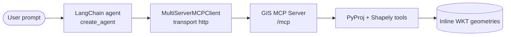

# LangChain + GIS MCP: park buffer proximity

Build a small LangChain agent that uses **GIS MCP Server** tools to answer a real planning question: *does a proposed building fall within 100 meters of a park?*

This tutorial uses current LangChain APIs (`create_agent` + `langchain-mcp-adapters` / `MultiServerMCPClient`). It does **not** use deprecated LangChain agent executors.

**Sample code:** [`agents/Langchain/`](https://github.com/mahdin75/gis-mcp/tree/main/agents/Langchain)

**Related:** [LangChain overview](README.md) · [Agent tutorials](../README.md) · [Architecture](../architecture.md) · [Best practices](../best-practices.md)

## 1. What this example builds

You will run:

1. **GIS MCP Server** in HTTP mode (tool backend).
2. A **LangChain agent** that discovers MCP tools and calls them.
3. A fixed **park / building proximity workflow** (also available as `--demo`):

   - Choose a UTM CRS for the study area (`get_utm_crs`)
   - Project park and building polygons from EPSG:4326 (`project_geometry`)
   - Buffer the park by **100 m** (`buffer`)
   - Test overlap with the building (`intersection`)
   - Measure geodetic distance between centroids (`get_centroid`, `calculate_geodetic_distance`)

No shapefiles are required—geometries are inline WKT.

## 2. Architecture overview



| Layer | Role in this example |
| ----- | -------------------- |
| LangChain | Plans steps, selects tools, explains results |
| `langchain-mcp-adapters` | Loads GIS MCP tools into LangChain tool objects |
| GIS MCP | Executes CRS, projection, buffer, intersection, distance |
| LLM | OpenRouter or OpenAI via `ChatOpenAI` (your API key) |

## 3. Prerequisites

- Python **3.10+**
- Ability to open two terminals (server + agent)
- An LLM API key: **OpenRouter** (`OPENROUTER_API_KEY`) or **OpenAI** (`OPENAI_API_KEY`)
- Network access to install packages and call the LLM provider

You do **not** need GIS extras (`[climate]`, `[visualize]`, …) for this tutorial—only the core `gis-mcp` install.

## 4. Python and package requirements

Agent dependencies (from `agents/Langchain/requirements.txt`):

```text
langchain>=1.0.0
langchain-openai>=1.0.0
langchain-core>=1.0.0
langchain-mcp-adapters>=0.1.0
python-dotenv>=1.0.0
```

GIS MCP is installed separately (see next section).

## 5. GIS-MCP installation

```bash
pip install uv
uv venv --python=3.10
# Windows
.\.venv\Scripts\Activate.ps1
# macOS/Linux
source .venv/bin/activate

uv pip install gis-mcp
```

Or with pip: `pip install gis-mcp`.

Editable install from this repo: see [Developers](../../install/developers.md).

## 6. LangChain installation

```bash
cd agents/Langchain
pip install -r requirements.txt
```

Official MCP integration docs: [LangChain MCP](https://docs.langchain.com/oss/python/langchain/mcp).

## 7. GIS-MCP configuration

### Environment file for the agent

```bash
cd agents/Langchain
copy .env.example .env   # Windows
# cp .env.example .env   # macOS/Linux
```

Edit `.env` (never commit real keys):

```env
OPENROUTER_API_KEY=your_openrouter_api_key_here
# or: OPENAI_API_KEY=your_openai_api_key_here
```

Optional:

```env
GIS_MCP_URL=http://127.0.0.1:9010/mcp
GIS_MCP_CLIENT_TRANSPORT=streamable_http
GIS_AGENT_MODEL=deepseek/deepseek-chat-v3.1
NO_PROXY=127.0.0.1,localhost
```

### Start GIS MCP (HTTP)

In a **separate** terminal:

```powershell
$env:GIS_MCP_TRANSPORT="http"
$env:GIS_MCP_HOST="127.0.0.1"
$env:GIS_MCP_PORT="9010"
gis-mcp
```

```bash
export GIS_MCP_TRANSPORT=http
export GIS_MCP_HOST=127.0.0.1
export GIS_MCP_PORT=9010
gis-mcp
```

You should see the MCP endpoint at `http://127.0.0.1:9010/mcp` (or the host you configured).

Prefer **`127.0.0.1`** in client URLs. On some networks, `localhost` is routed through an HTTP proxy and MCP calls return **503**.

Details: [HTTP Transport](../../http-transport.md), [Endpoints](../../endpoints.md).

### Client transport note

GIS MCP serves streamable HTTP at `/mcp`. With `langchain-mcp-adapters` **0.1.x** (used by this sample), set the client transport to **`streamable_http`** (default in the sample code).

Newer LangChain docs may show `"transport": "http"` as an alias for the same protocol—if your installed adapter rejects `http`, keep `streamable_http`. Override with `GIS_MCP_CLIENT_TRANSPORT` if needed.

## 8. Complete runnable code

Primary agent: [`agents/Langchain/my_gis_agent.py`](https://github.com/mahdin75/gis-mcp/blob/main/agents/Langchain/my_gis_agent.py)

LLM-free workflow check: [`agents/Langchain/verify_tools.py`](https://github.com/mahdin75/gis-mcp/blob/main/agents/Langchain/verify_tools.py)

### Run the no-LLM verification (recommended first)

```bash
cd agents/Langchain
python verify_tools.py
```

Expected ending line: `PASS park-buffer proximity workflow via MCP tools`.

### Run the agent demo (requires API key)

```bash
python my_gis_agent.py --demo
```

### Interactive mode

```bash
python my_gis_agent.py
```

Core pattern (matches [LangChain MCP quickstart](https://docs.langchain.com/oss/python/langchain/mcp)):

```python
from langchain.agents import create_agent
from langchain_mcp_adapters.client import MultiServerMCPClient
from langchain_openai import ChatOpenAI

client = MultiServerMCPClient(
    {
        "gis": {
            "transport": "streamable_http",
            "url": "http://127.0.0.1:9010/mcp",
        }
    }
)
tools = await client.get_tools()
# Optional: keep only the tools this workflow needs
allowed = {
    "calculate_geodetic_distance",
    "get_utm_crs",
    "get_crs_info",
    "project_geometry",
    "buffer",
    "intersection",
    "get_area",
    "get_centroid",
    "is_valid",
}
tools = [t for t in tools if t.name in allowed]

agent = create_agent(
    model=ChatOpenAI(model="gpt-4o-mini", api_key="..."),
    tools=tools,
    system_prompt="You are a GIS analyst. Use MCP tools for all spatial math.",
)
result = await agent.ainvoke({"messages": [{"role": "user", "content": "..."}]})
```

## 9. Important code sections

### MCP client

`MultiServerMCPClient` discovers tools from the live GIS MCP process. Connection is established when tools are fetched / invoked (stateless sessions by default per LangChain docs).

### Tool allow-list

GIS MCP can expose many tools. This sample filters to Shapely/PyProj operations needed for CRS-aware buffering so the agent stays reliable and cheaper to run.

### Meter-safe buffering

Buffering lon/lat (EPSG:4326) with `distance=100` would mean **100 degrees**, not meters. The system prompt and demo force:

1. `get_utm_crs`
2. `project_geometry` → UTM
3. `buffer` with `100` (meters in that CRS)

### Demo query

`DEMO_QUERY` in `my_gis_agent.py` embeds two small Manhattan-area polygons and asks for the full analysis sequence so runs are reproducible.

## 10. Example user prompts

Use these in interactive mode (server must be running):

**Demo scenario (same as `--demo`):**

> Buffer the park POLYGON((-73.9730 40.7720, -73.9710 40.7720, -73.9710 40.7735, -73.9730 40.7735, -73.9730 40.7720)) by 100 meters in a suitable UTM CRS and test intersection with building POLYGON((-73.9705 40.7724, -73.9698 40.7724, -73.9698 40.7729, -73.9705 40.7729, -73.9705 40.7724)). Also report geodetic distance between centroids.

**Shorter checks:**

> Using GIS tools, calculate the geodetic distance in meters between points [-73.9720, 40.77275] and [-73.97015, 40.77265].

> What UTM CRS should I use for longitude -73.972, latitude 40.773?

> Project POINT(-73.972 40.773) from EPSG:4326 to the UTM CRS from get_utm_crs, buffer by 50 meters, and report get_area of the buffer.

## 11. Expected outputs

### `verify_tools.py`

- Discovers tools from the server
- Prints `OK` lines for `get_utm_crs`, `project_geometry`, `buffer`, `intersection`, `get_area`, `get_centroid`, `calculate_geodetic_distance`
- Summary similar to:

```text
UTM CRS: EPSG:32618
Building intersects 100 m park buffer: True
Buffer area (m^2 in UTM): ~1.27e5
Geodetic centroid distance (m): ~156.6
PASS park-buffer proximity workflow via MCP tools
```

Exact EPSG code and area/distance depend on library versions and the fixture polygons; for this tutorial’s WKT, a **100 m** park buffer **should intersect** the building and centroid distance is on the order of **150–160 m**.

### `my_gis_agent.py --demo`

- Logs which tools were called
- Final answer should state that the building **is** within 100 m of the park (intersection non-empty) and include a geodetic distance from tools
- Wording varies by model; numbers should come from tool results, not invention

## 12. Troubleshooting

| Symptom | What to check |
| ------- | ------------- |
| `Failed to connect` / `get_tools` errors | GIS MCP not running, wrong port, or firewall. Confirm `http://127.0.0.1:9010/mcp`. |
| HTTP **503** to `/mcp` while server logs look healthy | Proxy intercepting `localhost`. Use `127.0.0.1` and set `NO_PROXY=127.0.0.1,localhost`. |
| `No LLM API key` | Set `OPENROUTER_API_KEY` or `OPENAI_API_KEY` in `.env`. |
| Agent buffers in degrees | Prompt/system instructions ignored—remind it to project to UTM first; use `--demo` and the allow-list sample. |
| Missing tools in verify | Reinstall `gis-mcp`; ensure you are not pointing at a different MCP server. |
| Transport errors mentioning `http` vs `streamable_http` | Use `GIS_MCP_CLIENT_TRANSPORT=streamable_http` with adapters 0.1.x. |
| OpenRouter model errors | Change `GIS_AGENT_MODEL` to a model available on your account. |

## 13. Limitations

- **LLM required** for the agent path; spatial truth is validated without an LLM via `verify_tools.py`.
- Tool filtering omits GeoPandas/Rasterio/PySAL/data extras—extend `ALLOWED_TOOL_NAMES` when you need them.
- Inline WKT is for teaching; production apps usually use files + GeoPandas tools + storage paths ([Storage](../../storage-configuration.md)).
- Buffer “100 meters” is meaningful only after projection to a metric CRS (as taught here).
- Agent answers depend on the chosen model; always prefer tool outputs over prose estimates.
- GIS MCP does not provide LangChain memory or multi-agent orchestration.

## 14. Links

**LangChain**

- [MCP in LangChain](https://docs.langchain.com/oss/python/langchain/mcp)
- [`langchain-mcp-adapters`](https://github.com/langchain-ai/langchain-mcp-adapters)
- [Agents / `create_agent`](https://docs.langchain.com/oss/python/langchain/agents)

**GIS MCP**

- [Agent tutorials overview](../README.md)
- [GIS MCP agent architecture](../architecture.md)
- [Best practices](../best-practices.md)
- [HTTP transport](../../http-transport.md)
- [Getting started](../../getting-started.md)
- Tools used here: [get_utm_crs](../../api/pyproj/get_utm_crs.md), [project_geometry](../../api/pyproj/project_geometry.md), [buffer](../../api/shapely/buffer.md), [intersection](../../api/shapely/intersection.md), [get_centroid](../../api/shapely/centroid.md), [calculate_geodetic_distance](../../api/pyproj/calculate_geodetic_distance.md), [get_area](../../api/shapely/get_area.md)
