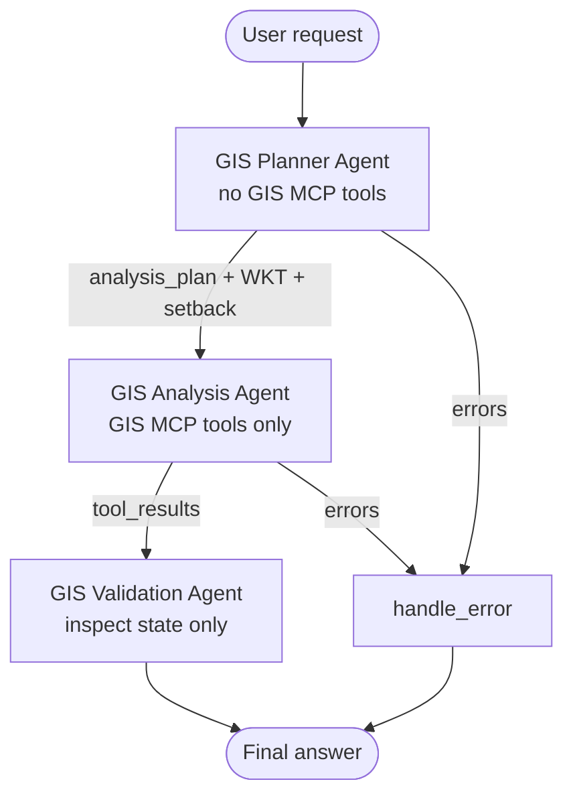
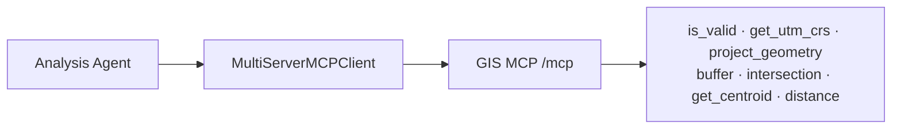

# Multi-agent geospatial workflow (LangGraph + GIS MCP)

A **practical** three-agent LangGraph pipeline for a river **setback compliance** check. Agents have separated jobs; only one of them calls GIS MCP.

This is **not** “more agents for the sake of a demo.” It isolates planning, tool execution, and QA so CRS mistakes and bad geometries are caught before a final answer.

**Sample code:** [`agents/LangGraph/multi_agent_workflow.py`](https://github.com/mahdin75/gis-mcp/blob/main/agents/LangGraph/multi_agent_workflow.py)

**Related:** [Stateful single pipeline](stateful-geospatial-agent.md) · [LangGraph overview](README.md) · [Best practices](../best-practices.md)

Multi-agent designs are **not always better**. See [When a single-agent design is preferable](#when-a-single-agent-design-is-preferable).

## Why multiple agents are useful here

Setback analysis mixes three different failure modes:

1. **Misread request** — wrong geometries or buffer distance  
2. **Wrong GIS sequence** — buffering lon/lat in degrees, skipping projection  
3. **Unchecked results** — empty intersections, mismatched CRS, implausible distances  

Putting those concerns in one free-form agent (or one prompt) often collapses into “call tools until something looks right.” Three roles keep:

- **Planner** from calling tools  
- **Analysis** from rewriting the study mid-flight  
- **Validation** from re-running expensive GIS (it only reads `tool_results`)

That separation matters for compliance-style GIS questions where an invented meter value is worse than a clear failure.

## Sample geospatial task

> Does the proposed building encroach a **150 m** setback from a river hazard centerline?

- Hazard: `LINESTRING(...)` in WGS 84  
- Building: `POLYGON(...)` in WGS 84  
- Require UTM before buffering; report intersection + geodetic distance from building centroid to a hazard sample point  

(Inline WKT only—core GIS MCP tools, no extras.)

## Architecture diagram





## Agent responsibilities

| Agent | Responsibility | May call GIS MCP? |
| ----- | -------------- | ----------------- |
| **GIS Planner** | Interpret request; emit WKT, setback meters, ordered `analysis_plan` | **No** |
| **GIS Analysis** | Execute the plan with GIS MCP (validate geoms, UTM, project, buffer, intersect, distance) | **Yes** (allow-listed tools) |
| **GIS Validation** | Check CRS assumptions, validity flags, projection targets, result consistency | **No** (reads `tool_results` only) |

## Shared state

`MultiAgentGISState` is the single shared blackboard:

| Field | Written by | Read by |
| ----- | ---------- | ------- |
| `user_request` | caller | Planner |
| `hazard_wkt`, `building_wkt`, `setback_meters`, `representative_lonlat`, `analysis_plan`, `planner_notes` | Planner | Analysis, Validation |
| `tool_results`, `analysis_summary` | Analysis | Validation |
| `validation_ok`, `validation_findings`, `final_answer` | Validation | user |
| `agent_log` | all agents | audit / debugging |
| `errors` | any | routing to `handle_error` |

## Message flow and task delegation

1. Graph starts at **Planner** (`START → planner_agent`).  
2. On success, conditional edge delegates to **Analysis** with the structured plan already in state (no second “what should we do?” debate).  
3. On Analysis success, **Validation** runs once.  
4. Failures short-circuit to **handle_error** — no silent retries that burn tokens/tools.

Delegation is **edge-based**, not chatty peer messaging: each agent writes fields; the next agent consumes them.

## Tool access

- Only **Analysis** constructs `MultiServerMCPClient` and invokes tools.  
- Allow-list: `is_valid`, `get_utm_crs`, `get_crs_info`, `project_geometry`, `buffer`, `intersection`, `get_centroid`, `calculate_geodetic_distance`, `get_area`.  
- Planner/Validation calling tools is treated as a design bug (enforced by code structure; Analysis also rejects non-allow-listed names).

Transport: `streamable_http` → `http://127.0.0.1:9010/mcp` (same pattern as other Python samples).

## Failure handling

| Failure | Behavior |
| ------- | -------- |
| Planner cannot parse WKT | `errors` set → `handle_error` |
| MCP down / missing tools | Analysis fails → `handle_error` |
| Invalid geometries / missing CRS | Analysis or Validation fails closed |
| Implausible distance vs intersection | Validation **FAIL** (likely CRS/coord bug) |

No invented setback distances are returned on failure.

## How to avoid redundant agent calls

- **One pass** Planner → Analysis → Validation (no debate loops).  
- Validation **does not** re-buffer or re-project; it audits payloads already in state.  
- Demo/verify use `SKIP_LLM_PLANNER=1` so Planner is heuristic (zero LLM cost).  
- Do not add a fourth “summarizer” agent unless you need a separate audience-facing rewrite; Validation already composes `final_answer`.

## When a single-agent design is preferable

Prefer the [stateful single pipeline](stateful-geospatial-agent.md) or [LangChain agent](../langchain/basic-geospatial-agent.md) when:

- The task is a short Q&A with one or two tool calls  
- You do not need a separate compliance-style QA gate  
- Latency/cost budgets are tight (extra agent nodes add overhead when LLMs are enabled)  
- One developer owns the whole prompt and a graph would be ceremony  

Use **this multi-agent** flow when planning, execution, and QA must stay auditable and separated—especially setback/compliance-style checks.

## Cost and latency tradeoffs

| Mode | LLM calls | MCP tool round-trips | Notes |
| ---- | --------- | -------------------- | ----- |
| `verify_multi_agent.py` / `--demo` | 0 | ~8 Analysis calls | Recommended for CI |
| Planner LLM + template Validation | 1 | ~8 | Planner structured output only |
| Planner + Analysis narrative + Validation polish | 2–3 | ~8 | Highest cost; usually unnecessary |

Multi-agent **increases** coordination overhead versus one `create_agent` loop. The pay-off is fewer wrong CRS buffers and clearer failure modes—not automatically better answers.

## Production considerations

- Pin `langgraph`, `langchain-mcp-adapters`, and `gis-mcp` versions.  
- Run GIS MCP as a separate HTTP process; use `127.0.0.1` + `NO_PROXY` if proxies break `localhost`.  
- Keep tool allow-lists small; do not expose all ~90 tools to Analysis.  
- Log `agent_log` + `analysis_plan` for audit trails.  
- Do not auto-loop Analysis on Validation failure without a hard cap (cost/risk).  
- For real parcels, prefer GeoPandas file tools + storage paths over inline WKT.  
- Optional LLM Planner must be instructed not to invent coordinates (structured output + validation).

## Complete runnable code

| File | Role |
| ---- | ---- |
| [`multi_agent_workflow.py`](https://github.com/mahdin75/gis-mcp/blob/main/agents/LangGraph/multi_agent_workflow.py) | Graph + three agents |
| [`verify_multi_agent.py`](https://github.com/mahdin75/gis-mcp/blob/main/agents/LangGraph/verify_multi_agent.py) | No-LLM validation |
| `requirements.txt` | Shared LangGraph deps |

```bash
cd agents/LangGraph
pip install -r requirements.txt

# Terminal 1
# $env:GIS_MCP_TRANSPORT='http'; $env:GIS_MCP_HOST='127.0.0.1'; $env:GIS_MCP_PORT='9010'; gis-mcp

# Terminal 2
python verify_multi_agent.py
python multi_agent_workflow.py --demo
```

Graph wiring (simplified):

```python
graph = StateGraph(MultiAgentGISState)
graph.add_node("planner_agent", planner_agent)
graph.add_node("analysis_agent", analysis_agent)
graph.add_node("validation_agent", validation_agent)
graph.add_node("handle_error", handle_error)
graph.add_edge(START, "planner_agent")
graph.add_conditional_edges("planner_agent", route_after_planner)
graph.add_conditional_edges("analysis_agent", route_after_analysis)
graph.add_edge("validation_agent", END)
```

## Expected workflow output

`verify_multi_agent.py` should print `PASS` with:

- `agent_log` containing `planner`, `analysis`, `validation`  
- `validation_ok: True`  
- UTM CRS (typically `EPSG:32618` for the demo lon/lat)  
- Encroachment boolean from intersection  
- Geodetic distance in meters from building centroid to the hazard sample point  

Example shape:

```text
Multi-agent GIS setback workflow
- Setback: 150.0 m
- UTM CRS: EPSG:32618
- Building encroaches setback: True/False
- Geodetic distance ...: ~289 m
- Validation: PASS
- Agents invoked (order): planner, analysis, validation
PASS multi-agent LangGraph GIS MCP workflow
```

For the demo WKT, the building **encroaches** the 150 m setback (`True`) and geodetic distance to the hazard sample is about **289 m**.
## Troubleshooting

| Issue | Fix |
| ----- | --- |
| Missing tools | Start GIS MCP HTTP; core install is enough |
| HTTP 503 | Use `127.0.0.1` and `NO_PROXY` |
| Planner fails without key | Use `--demo` / verify (`SKIP_LLM_PLANNER=1`) |
| Confused with single-agent tutorial | Different task (setback vs transit coverage) and three named agents |

## Official links

- [LangGraph quickstart](https://docs.langchain.com/oss/python/langgraph/quickstart)  
- [`langchain-mcp-adapters`](https://github.com/langchain-ai/langchain-mcp-adapters)  
- [GIS MCP agent architecture](../architecture.md)  
- [Stateful LangGraph tutorial](stateful-geospatial-agent.md)  
- [HTTP transport](../../http-transport.md)
