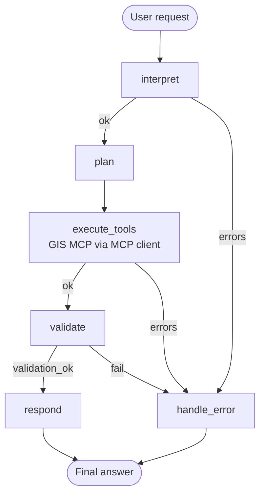
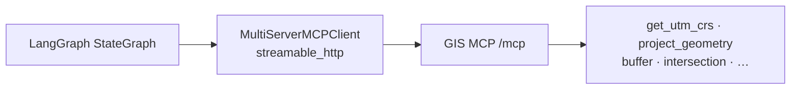

# LangGraph + GIS MCP: stateful site-coverage workflow

Build a **stateful LangGraph** pipeline that answers: *is a school within a 400 m walking buffer of a transit stop?*

This tutorial is intentionally different from the [LangChain park-buffer agent](../langchain/basic-geospatial-agent.md). That sample uses a free-form tool-calling agent. Here, **graph nodes own control flow**: interpret → plan → execute GIS MCP tools → validate → respond, with an error branch.

**Sample code:** [`agents/LangGraph/`](https://github.com/mahdin75/gis-mcp/tree/main/agents/LangGraph)

**Related:** [LangGraph overview](README.md) · [Agent tutorials](../README.md) · [Architecture](../architecture.md) · [Best practices](../best-practices.md)

## Why LangGraph for GIS (vs a simple LangChain agent)

| | LangChain agent (`create_agent`) | This LangGraph workflow |
| - | -------------------------------- | ----------------------- |
| Control flow | Model decides tool order each turn | Graph edges enforce CRS-safe order |
| State | Mostly chat messages | Explicit `GISWorkflowState` (plan, tool_results, validation) |
| Planning | Implicit in the system prompt | Dedicated **plan** node writes `plan_steps` |
| Validation | Optional / prompt-only | Dedicated **validate** node can fail the run |
| Errors | Often mixed into chat | **handle_error** branch; no invented numbers |
| Best when | Exploratory Q&A | Repeatable multi-step GIS pipelines |

GIS MCP stays the same tool server either way. LangGraph adds **orchestration and memory of intermediate GIS facts**.

## 1. Architecture diagram



MCP wiring (same transport pattern as other samples):



## 2. State definition

`GISWorkflowState` holds everything the pipeline needs across nodes:

| Field | Purpose |
| ----- | ------- |
| `user_request` | Raw natural-language + WKT request |
| `site_a_wkt` / `site_b_wkt` | Interpreted geometries (A buffered, B tested) |
| `buffer_meters` | Metric buffer distance |
| `representative_lonlat` | `[lon, lat]` for `get_utm_crs` |
| `plan_steps` | Ordered GIS steps (audit trail) |
| `tool_results` | Raw GIS MCP payloads keyed by step |
| `validation_ok` / `validation_notes` | Gate before final answer |
| `errors` | Structured failure reasons |
| `final_answer` | User-facing output |
| `stage` | `interpreted` → `planned` → `executed` → `validated` → `done` / `failed` |

## 3. Graph nodes

| Node | Role |
| ---- | ---- |
| **interpret** | Parse request into WKT + buffer meters (LLM structured output *or* heuristic for `--demo` / verify) |
| **plan** | Write a fixed CRS-safe plan into state (no free-form tool improvisation) |
| **execute_tools** | Call GIS MCP tools via `MultiServerMCPClient` in plan order |
| **validate** | Check CRS present, intersection emptiness, distance vs buffer consistency |
| **respond** | Compose the answer from validated state (optional LLM polish) |
| **handle_error** | Return a failure message without inventing GIS numbers |

## 4. Tool execution

`execute_tools` loads a focused allow-list from GIS MCP and runs:

1. `is_valid` on both geometries  
2. `get_utm_crs` for the study area  
3. `project_geometry` (EPSG:4326 → UTM) for A and B  
4. `buffer` on projected A using **meters**  
5. `intersection` of buffer vs projected B  
6. `calculate_geodetic_distance` between lon/lat points  

Buffering happens **only after** projection—never “100 meters” in EPSG:4326 degrees.

## 5. Result validation

The **validate** node fails the run if:

- UTM CRS is missing  
- Geodetic distance is missing  
- Distance is clearly inside the buffer but intersection WKT is `EMPTY` (inconsistency)

Soft notes are attached when distance and intersection disagree in edge cases.

## 6. Error handling

Conditional edges send the graph to **handle_error** when:

- Interpret cannot find geometries  
- Any MCP tool raises / returns unusable payloads  
- Validation sets `validation_ok=False`  

The error node does **not** fabricate distances or intersections.

## 7. Complete runnable code

| File | Purpose |
| ---- | ------- |
| [`gis_workflow_graph.py`](https://github.com/mahdin75/gis-mcp/blob/main/agents/LangGraph/gis_workflow_graph.py) | StateGraph implementation |
| [`verify_graph.py`](https://github.com/mahdin75/gis-mcp/blob/main/agents/LangGraph/verify_graph.py) | No-LLM end-to-end check |
| `requirements.txt` | `langgraph`, `langchain-mcp-adapters`, … |
| `.env.example` | Optional LLM keys |

### Install

```bash
cd agents/LangGraph
pip install -r requirements.txt
```

### Start GIS MCP

```powershell
$env:GIS_MCP_TRANSPORT="http"
$env:GIS_MCP_HOST="127.0.0.1"
$env:GIS_MCP_PORT="9010"
gis-mcp
```

Prefer `127.0.0.1` in client URLs (proxy-safe). See the [LangChain tutorial](../langchain/basic-geospatial-agent.md) troubleshooting notes for HTTP 503 on `localhost`.

### Verify (no LLM required)

```bash
python verify_graph.py
```

### Demo

```bash
python gis_workflow_graph.py --demo
```

Core graph wiring (simplified):

```python
from langgraph.graph import StateGraph, START, END

graph = StateGraph(GISWorkflowState)
graph.add_node("interpret", interpret_node)
graph.add_node("plan", plan_node)
graph.add_node("execute_tools", execute_tools_node)
graph.add_node("validate", validate_node)
graph.add_node("respond", respond_node)
graph.add_node("handle_error", handle_error_node)

graph.add_edge(START, "interpret")
graph.add_conditional_edges("interpret", route_after_interpret)
graph.add_edge("plan", "execute_tools")
graph.add_conditional_edges("execute_tools", route_after_execute)
graph.add_conditional_edges("validate", route_after_validate)
graph.add_edge("respond", END)
graph.add_edge("handle_error", END)
app = graph.compile()
```

MCP tools (adapters 0.1.x):

```python
client = MultiServerMCPClient({
    "gis": {
        "transport": "streamable_http",
        "url": "http://127.0.0.1:9010/mcp",
    }
})
tools = await client.get_tools()
```

## 8. Example requests

**Demo (built-in):**

> Is this school within a 400-meter walking buffer of the transit stop?  
> Transit: `POINT(-73.9855 40.7580)`  
> School: `POINT(-73.9820 40.7595)`

**Custom:**

```text
Is POINT(-74.0060 40.7128) within 250 meters of POINT(-74.0075 40.7138)?
Use UTM for buffering and report geodetic distance.
```

## 9. Expected outputs

`verify_graph.py` / `--demo` should end with `stage: done`, `validation_ok: True`, and a summary similar to:

```text
- Buffer distance: 400.0 m
- UTM CRS: EPSG:32618
- Site B intersects buffered site A: True
- Geodetic distance: ~339 m
- Validation: PASS
PASS LangGraph stateful GIS MCP workflow
```

Exact distance depends on library versions; for the demo points it is typically **~330–350 m** and **inside** the 400 m buffer.

## 10. Workflow explanation

1. **interpret** — Turns prose + WKT into typed fields (state), instead of hoping a ReAct agent remembers them across tool calls.  
2. **plan** — Records the CRS-safe sequence so every run is auditable.  
3. **execute_tools** — Talks to GIS MCP only; no desktop-GIS hallucination.  
4. **validate** — Treats GIS results as data to check, not as chat fluff.  
5. **respond** — Answers from validated state; optional LLM rewrite cannot invent new measurements when using the template path (`SKIP_LLM_RESPOND=1`).

That separation is the point of LangGraph for GIS: **planning and validation are first-class**, not buried in a single agent prompt.

## 11. Troubleshooting

| Symptom | Fix |
| ------- | --- |
| `Missing GIS MCP tools` | Start `gis-mcp` HTTP; confirm core install (no extras required). |
| HTTP 503 on `/mcp` | Use `http://127.0.0.1:.../mcp` and `NO_PROXY=127.0.0.1,localhost`. |
| `Unsupported transport: http` | Use `streamable_http` with `langchain-mcp-adapters` 0.1.x. |
| Interpret fails without API key | Use `--demo` / `verify_graph.py` (heuristic interpret) or set a key. |
| Validation FAIL on custom WKT | Ensure lon/lat order, valid WKT, and buffer large enough for your points. |
| Confused with LangChain sample | Different scenario (transit coverage) and different orchestration model—see table above. |

## Prerequisites and packages

- Python 3.10+  
- GIS MCP Server (HTTP)  
- `agents/LangGraph/requirements.txt` (`langgraph>=1.0`, `langchain-mcp-adapters`, …)  
- LLM key **optional** for verify/demo; required only if you enable LLM interpret/respond  

## Official links

- [LangGraph quickstart](https://docs.langchain.com/oss/python/langgraph/quickstart)  
- [`langchain-mcp-adapters`](https://github.com/langchain-ai/langchain-mcp-adapters) (LangGraph `StateGraph` + MCP tools)  
- [GIS MCP agent architecture](../architecture.md)  
- [HTTP transport](../../http-transport.md)  
- Tools: [get_utm_crs](../../api/pyproj/get_utm_crs.md), [project_geometry](../../api/pyproj/project_geometry.md), [buffer](../../api/shapely/buffer.md), [intersection](../../api/shapely/intersection.md), [calculate_geodetic_distance](../../api/pyproj/calculate_geodetic_distance.md)
